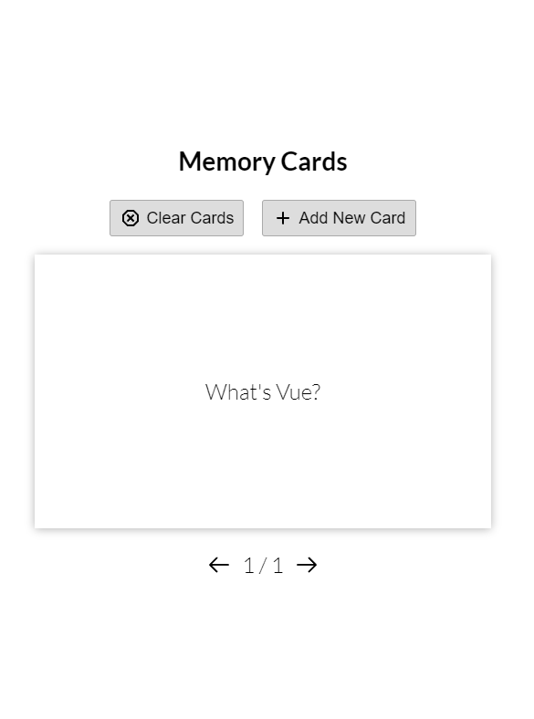

# Vue 3 memory-cards

  
Application for creating and saving cards

  
- Add and remove cards

- Ask question and show answer

- Save cards to local storage


  


## Project Setup

```sh
npm install
```

### Compile and Hot-Reload for Development

```sh
npm run dev
```

### Compile and Minify for Production

```sh
npm run build
```
